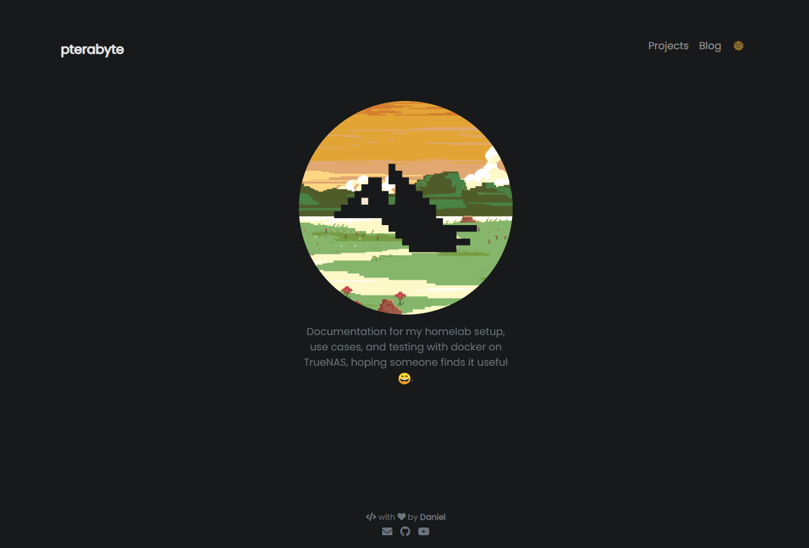

  <h1>pterabyte.dev</h1>
  <i>Repository containing all of the files required for building my website on Github Pages and was created by modifying the portfolYOU Jekyll theme. This page is a central point to share different configurations and testing that is being done in my home lab. Currently my setup is mainly running on docker in truenas.</i>
  <a href="https://pterabyte.dev">Website</a>
  
  © 2025 pterabyte.dev.

